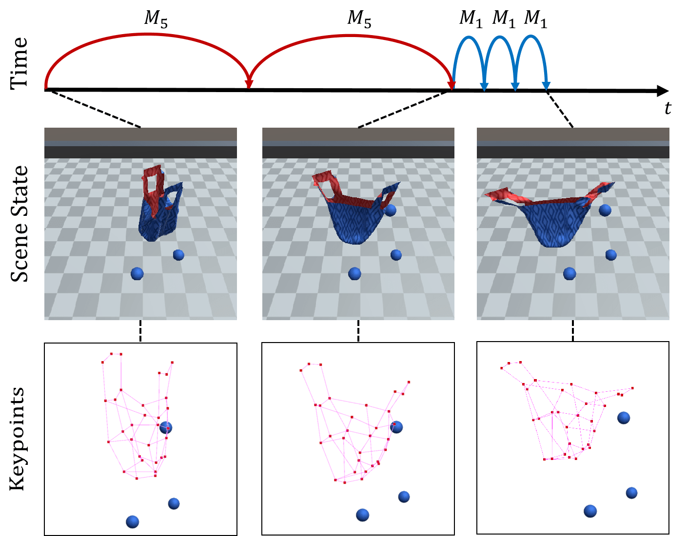

# Graph-based Task-specific Prediction Models for Interactions between Deformable and Rigid Objects

This repository contains the code for learning to predict action effects in scenes with rich interactions between a deformable bag and multiple rigid objects.
For this purpose, we generated a [dataset](https://github.com/wengzehang/deformable_rigid_interaction_prediction/blob/main/docs/dataset.md) containing actions like pushing an object towards the bag, opening the bag, lifting the bag and moving the handles of the bag along a trajectory.

## Graph Representation

We represent the scene as a graph, where the vertices represent rigid objects and keypoints on the deformable bag.
Each vertex encodes the position, radius and a fixed flag indicating whether the vertex is grasped, i.e. fixed in place.
The edges create a fully connected graph and contain the pair-wise position differences between the vertices and a physical connection flag which connects adjacent keypoints on the bag.
The global graph attribute encodes action parameters.

## Prediction Models

### Dynamics Module (PPM, APM)

We propose a Position Prediction Module (PPM) and an Active Prediction Module (APM), both based on [graph nets](https://github.com/deepmind/graph_nets).
The PPM predicts, given the current scene state, the state in the next time step while the APM classifies which vertices will move in the next time step.
We compare a one-stage model (PPM alone) with a two-stage model (APM + PPM) and show the benefits of the two-stage approach.

### Long Horizon Prediction

The graph prediction models only predict the scene for a fixed prediction horizon ```h```. 
To increase the prediction stability, we train a longer horizon model with a prediction horizon ```h=5```, 
and a single time step model with a horizon ```h=1```. 
By chaining these models recursively together, we make predictions for any time step. In this project, we compare the 
mix-horizon model with the one-stage/two-stage model, and show the benefits of mix-horizon strategy.

